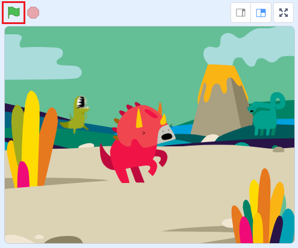
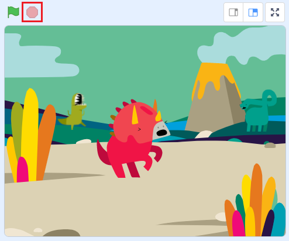

# 1.はじめに(Introduction)

このドキュメントでは、Scratch 3.0を使ったアニメーションの作成方法を説明します。

  This document explains how to create animations using Scratch 3.0.

ドキュメント作成者：望月 綾子(NTTテクノクロスサービス株式会社)、神長 貴博(NTTテクノクロス株式会社)

  Document Author：Ayako Mochizuki(NTT TechnoCrossService Corporation)、Takahiro Jincho(NTT TechnoCross Corporation)

# 2.準備：開発環境(Preparation:Development environment)

- Scratch公式サイト(https://scratch.mit.edu/download)から、Scratch 3.0をダウンロード、インストールします。(Scratch 3.0は、Windows、macOS、chromeOS、Androidに対応。(2020/04/13時点))

  Download and install Scratch 3.0 from the Scratch official website(https://scratch.mit.edu/download).(Scratch 3.0 is compatible with Windows, macOS, chromeOS, Android. (As of 2020/04/13))

# 3. 作り方(How to develop)

このアニメーションは、以下5つのプログラムで構成されています。

  This animation consists of the following five programs.

- 背景(Background)
- 恐竜2(dinosaur2)
- 幽霊(ghost)
- 恐竜1(dinosaur1)
- 恐竜4(dinosaur4)

ここでは、各プログラムの作り方を説明します。 以下表のプログラム名をクリックすると、プログラムの説明が表示されます。 プログラムは 『背景→恐竜2→幽霊→恐竜1→恐竜4』 の順番で作成します。

  In this section, we will explain how to make each program. Click on a program name in the table below to see a description of the program. Create a program in the order of "Background → Dinosaur 2 → Ghost → Dinosaur 1 → Dinosaur 4".

|プログラム名(Program name)|概要(Overview)|
|:----|:----|
|[背景(Background)](background.md)|背景のプログラムの説明(Background program description)
|[恐竜2(Dinosaur2)](dinosaur2.md)|恐竜2のプログラムの説明(Dinosaur2 program description)|
|[幽霊(Ghost)](ghost.md)|幽霊のプログラムの説明(Ghost program description)|
|[恐竜1(Dinosaur1)](dinosaur1.md)|恐竜1のプログラムの説明(Dinosaur1 program description)|
|[恐竜4(Dinosaur4)](dinosaur4.md)|恐竜4のプログラムの説明(Dinosaur4 program description)|

# 4.プログラムの保存方法(How to save the program)

Scratchのファイルのメニューから『コンピューターに保存する』を選択し、実行してください。

  From the Scrach file menu, select "Save to computer" and run it.

# 5. プログラムの実行・停止方法(How to run and stop the program)

## 5-1. プログラムを実行(Run the program)

旗のボタンを押してください。

  Press the flag button.

## 5-2. プログラムを停止(Stop the program)

赤いボタンを押してください。

  Press the red button.

