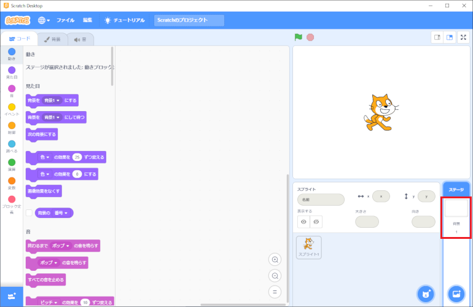
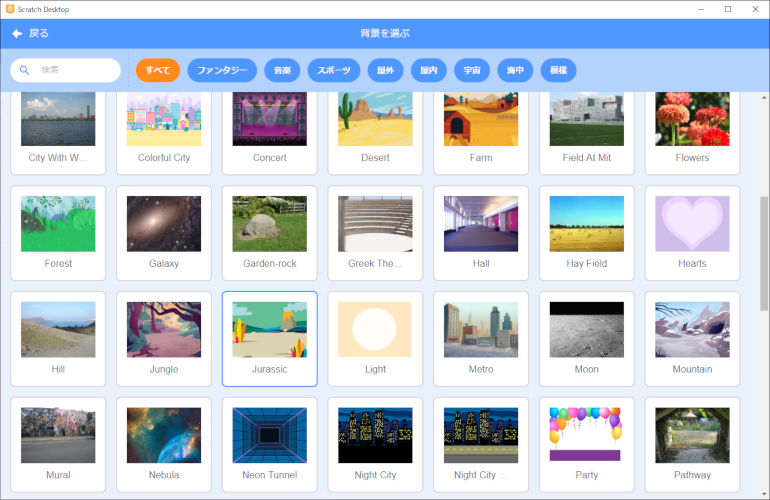
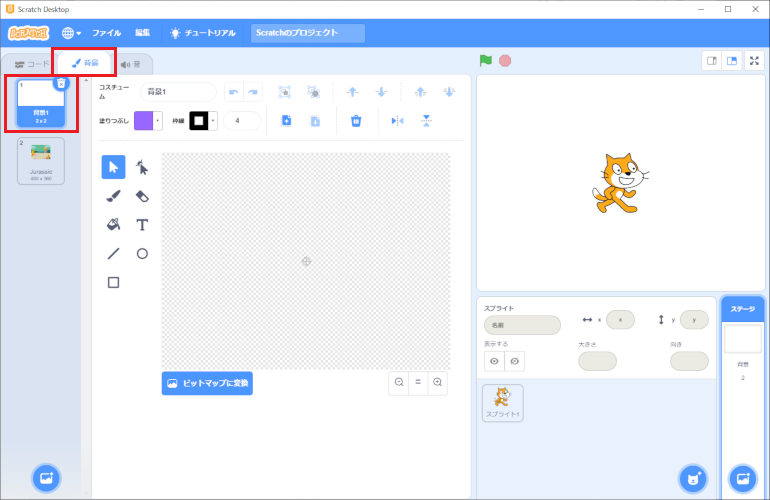

# 背景のプログラムの作り方(How to develop a background program)

## 1. プログラムの作り方(How to develop a program)

- 画面右下にある背景1をクリックします。

  Click on Background 1 at the bottom right of the screen.

- 背景のタブをクリックし、 を押します。

  Click on the Background tab and press  .

- 以下の画面が表示されるので、背景を選択します。(例：Jurassic)

  The following screen will display and you can select a background. (For example, select Jrassic.)

- 選んだ背景が追加されたことを確認後、『背景1』を削除してください。(背景1を選択→×をクリック)

  After confirming that the selected background has been added, delete "Background 1". (Select background 1 → click on the x)

- これでプログラムは完成です。

  The program is complete.
