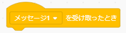

# 恐竜1のプログラムの作り方

## 1.プログラムを作る前の準備(Preparation before develop the program)

-  ボタンをクリックしてください。

  Click on the  button.

- Dinosaur1を選択、クリックしてください。

  Select Dinosaur1 and click on it.

- スプライトが設定されていることを確認してください。

  Make sure the sprites are set.

- **大きさを『40』に変更** してください。(数字をダブルクリックすることで、数字を編集できる状態になります。)

  Change the size to "40". (Double-click on the number to make it ready for editing.)

- **x座標を『193』に、y座標を『35』に変更** してください。(数字をダブルクリックすることで、数字を編集できる状態になります。)

  Set the x-coordinate to "193" and the y-coordinate to "35". (Double-click on the number to make it ready for editing.)

## 2. プログラムの作り方(How to develop a program)

### 2-1. 完成イメージ(Completed image)

### 2-2. 作り方(How to develop)

- 以下のブロックを画面中央にドラッグ&ドロップします。

  Drag and drop the following blocks to the center of the screen.

 

 

- 『コスチュームをdinosaur1-dにする』の▼ボタンを押し、表示される **一覧から『dinosaur1-a』を選んで** ください。

  Press ▼ on the "Make costume dinosaur1-d" button and select "dinosaur1-a" from the list of costumes that appears.

- ブロックをくっつけてください。

  Connect the blocks.

- 以下のブロックを画面中央にドラッグ&ドロップします。

  Drag and drop the following blocks to the center of the screen.

 

 

- 『コスチュームをdinosaur1-dにする』の▼ボタンを押し、表示される **一覧から『dinosaur1-b』を選んで** ください。

  Press ▼ on the "Make costume dinosaur1-d" button and select "dinosaur1-a" from the list of costumes that appears.

- ブロックをくっつけてください。

  Connect the blocks.

- 以下のブロックを画面中央にドラッグ&ドロップします。

  Drag and drop the following blocks to the center of the screen.

 

 

 

- 『コスチュームをdinosaur1-dにする』の▼ボタンを押し、表示される **一覧から『dinosaur1-c』を選んで** ください。

  Press ▼ on the "Make costume dinosaur1-d" button and select "dinosaur1-c" from the list of costumes that appears.

- 『メッセージ1を受け取ったとき』の▼ボタンを押して、表示される **一覧から『メッセージ7』を選んで** ください。

  Press the ▼ button on "When you received message 1" and select "Message 7" from the list that appears.

- 『1秒待つ』の「1」を **『0.05』に変更** してください。(数字をダブルクリックすることで、数字を編集できる状態になります。)

  Change "1" in "Wait 1 second" to "0.05". (Double-click on the number to make it ready for editing.)

- ブロックをくっつけてください。

  Connect the blocks.

- これで恐竜1のプログラムは完成です。

  The Dinosaur 1 program is now complete.
