# 恐竜2のプログラムの作り方

## 1.プログラムを作る前の準備(Preparation before develop the program)

- Scratch 3.0を起動し、スプライト1を削除してください。(スプライト1を選択→×をクリック)

  Start Scratch 3.0 and delete sprite 1.(Select sprite 1　→　Click ×)

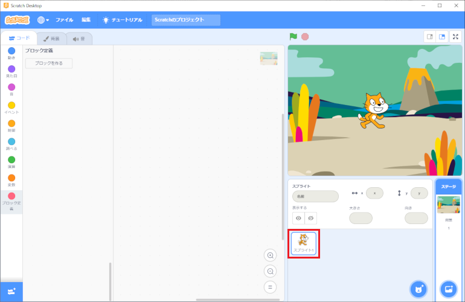

-  ボタンをクリックしてください。

  Click on the   button.

- Dinosaur2を選択、クリックしてください。

  Select Dinosaur2 and click on it.

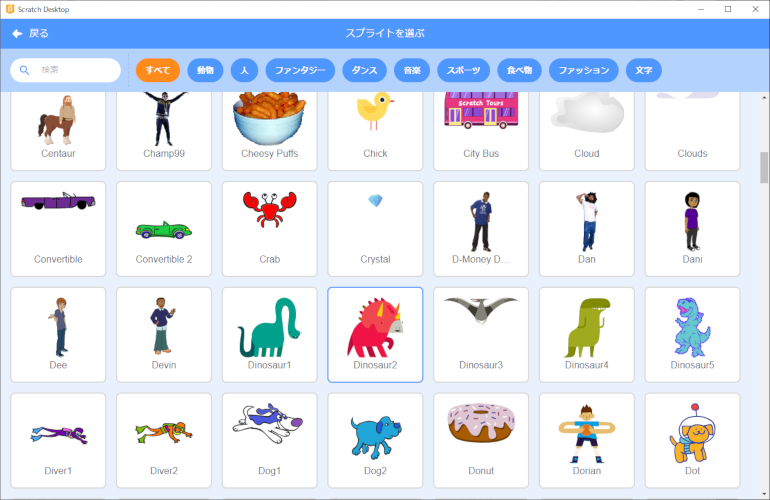

- スプライトが設定されていることを確認してください。

  Make sure the sprites are set.

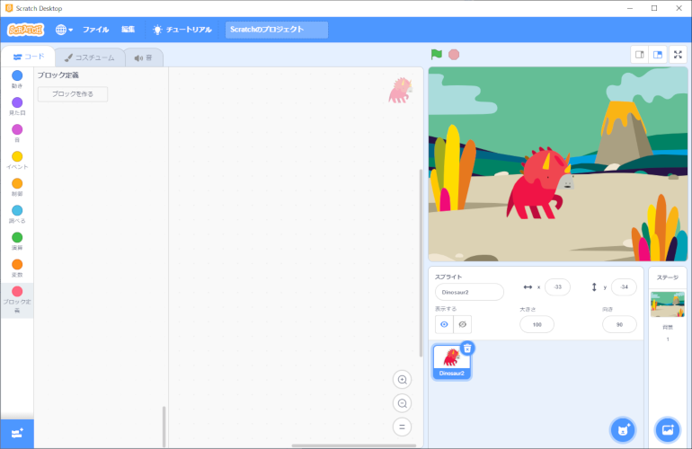

## 2. プログラムの作り方(How to develop a program)

### 2-1. 完成イメージ(Completed image)

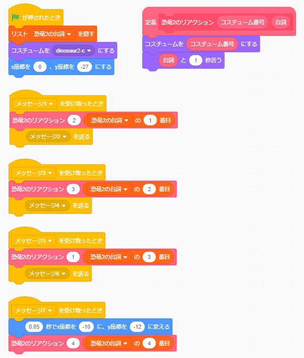

### 2-2. 作り方(How to develop)

-  を押してください。

  Press  .

-  を押してください。

  Press  .

- 以下の画面が表示されるので、 **『ブロック名』を『恐竜2のリアクション』に変更** してください。

  Change the "Block Name" to "Dinosaur 2's Reaction".

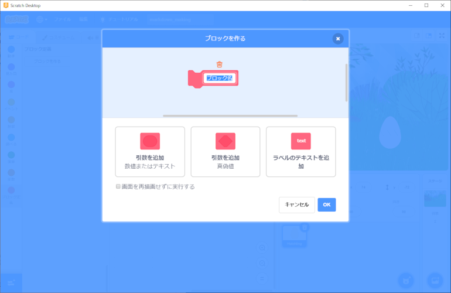

- 『引数を追加(数値またはテキスト)』をクリックし、 **『number or text』を『コスチューム番号』に変更** してください。

  Click on "Add argument (number or text)" and change "number or text" to "costume number".

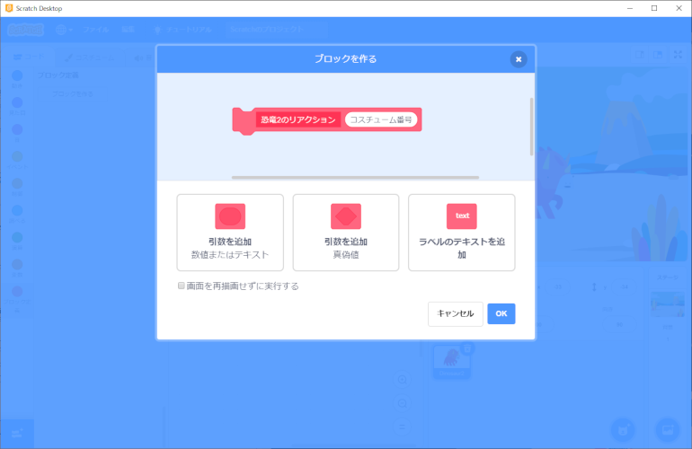

- もう一度『引数を追加(数値またはテキスト)』をクリックし、 **『number or text』を『台詞』に変更** し、OKボタンを押してください。

  Click "Add argument (number or text)" again, change "number or text" to "dialogue" and press the OK button.

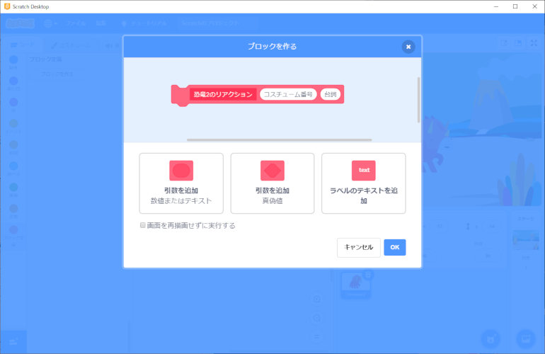

- 以下の画面が表示されることを確認してください。

  Confirm that the following screen is displayed.

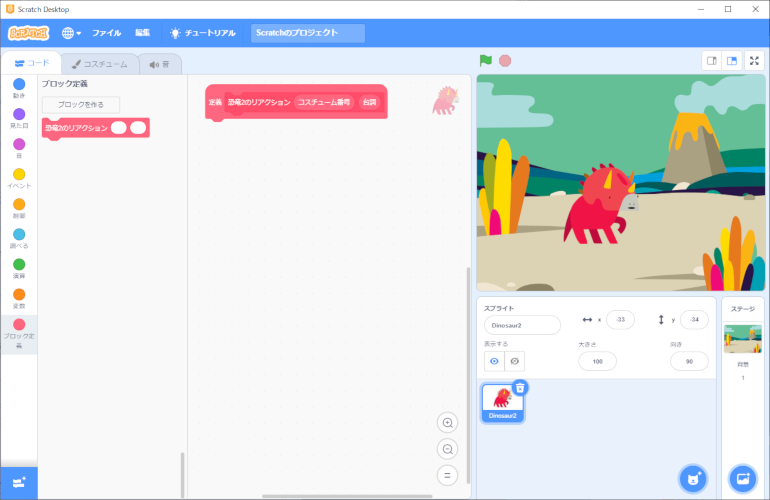

- 以下のブロックを画面中央にドラッグ&ドロップします。

  Drag and drop the following blocks to the center of the screen.

 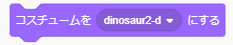 

-   の『[donosaur2-d』に  をドラッグ&ドロップしてください。

  Drag and drop  to "donosaur2-d" in  .

-   の『こんにちは！』に  をドラッグ&ドロップし、 **「2」を『1』に変更** してください。

   of "Hello!" drag and drop  to "1" and change "2" to "1".

- ブロックをくっつけてください。

  Connect the blocks.

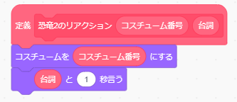

-  を押してください。

  Press  .

-  を押してください。

  Press  .

- **『新しいリスト名：』に『恐竜2の台詞』と入力後、『このスプライトのみ』を選択** してOKボタンを押してください。

  Enter "Dinosaur 2 dialogu" in the "New List Name:" field, select "This Sprite Only" and click the OK button.

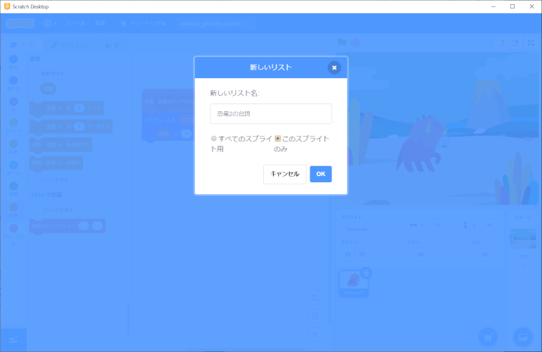

- 空のリストが画面上に表示されることを確認してください。

  Confirm that the blank list display on the screen.

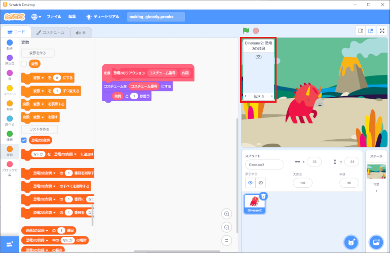

- リストの＋ボタンを押し、 **『えっ？』『何？』『誰？』『ギャーーー』**  計4項目を設定してください。(1つ入力したら＋ボタンで項目を追加していってください。)

  Press the + button on the list and say, "Huh?" "What?" "Who is it?" "Gah!" ,set a total of four items.(Once you have entered one item, please add more items by pressing the + button.)

- 以下のブロックを画面中央にドラッグ&ドロップします。

  Drag and drop the following blocks to the center of the screen.

 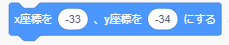

 

 

 

- 『x座標を○、y座標を○にする』の **x座標に『0』、y座標に『-27』と入れて** ください。(数字をダブルクリックすることで、数字を編集できる状態になります。)

  Enter "0" in the x-coordinate and "-27" in the y-coordinate in "Make x-coordinate X and y-coordinate X". (Double-click on the number to make it ready for editing.)

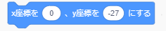

- 『コスチュームをdinosaur2-dにする』の▼ボタンを押し、表示される **コスチュームの一覧から『dinosaur2-c』を選んで** ください。

  Press ▼ on the "Make costume dinosaur2-d" button and select "dinosaur2-c" from the list of costumes that appears.

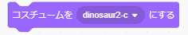

- ブロックをくっつけてください。

  Connect the blocks.

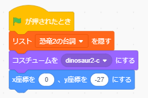

- 以下のブロックを画面中央にドラッグ&ドロップします。

  Drag and drop the following blocks to the center of the screen.

 

  ×4　  ×3

  ×4

  ×4

- 『○秒でx座標を○に、y座標を○に変える』のそれぞれの数字を、 **『0.05秒』、『x座標を-10』、『y座標を-12』に変更** してください。

  Change the numbers in "Change x-coordinate to X and y-coordinate to X in X seconds" to "0.05 seconds", "x-coordinate to -10", and "y-coordinate to -12", respectively.

- 『メッセージ1を送る』の▼ボタンを押して **『新しいメッセージ』を選択** してください。

  Press the ▼ button for "Send Message 1" and select "New Message".

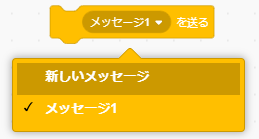

- 以下の画面が表示されることを確認し、 **『新しいメッセージ名：』に『メッセージ2』と入力し** OKボタンを押してください。

  Enter "Message 2" in the "New Message Name:" field and click the OK button.

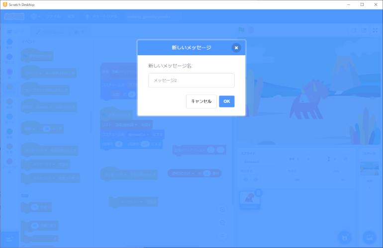

- 同様に **『メッセージ4を送る』『メッセージ6を送る』を作成** してください。

  Create "Send Message 4" and "Send Message 6" in the same way.

- 以下のブロックができます。

  You can create the following blocks.

 ,  , 

- 『メッセージ1を受け取ったとき』の▼ボタンを押して **『新しいメッセージ』を選択** してください。

Press the ▼ button under "When you received message 1" and select "New message".

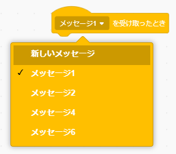

- 以下の画面が表示されることを確認し、 **『新しいメッセージ名：』に『メッセージ3』と入力し** OKボタンを押してください。

  Enter "Message 3" in the "New Message Name:" field and click the OK button.

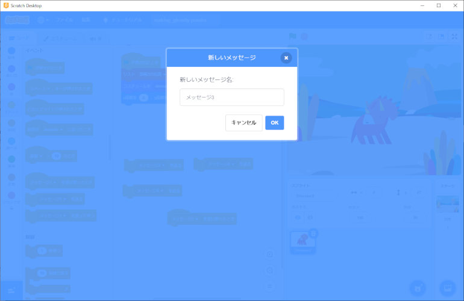

- 同様に **『メッセージ5を受け取ったとき』『メッセージ7を受け取ったとき』を作成** してください。

  Similarly, create "When I received message 5" and "When I received message 7".

- 『メッセージ○を受け取ったとき』のブロックが4種類できます。

  You can create 4 types of blocks for "when you receive a message".

 , 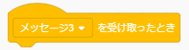 , 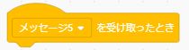 , 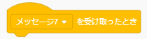

- 『恐竜2の台詞の1番目』の「1」を、それぞれ **『1』、『2』、『3』、『4』と設定** してください。(数字をダブルクリックすることで、数字を編集できる状態になります。)

  Set "1" in "Dinosaur 2" to "1", "2", "3", and "4", respectively. (Double-click on the number to make it ready for editing.)

 ,  ,  , 

- 『恐竜2のリアクション○○』の **左側の○に『2』を入れ** 、右側の○に『恐竜2の台詞の1番目』をドラッグ&ドロップしてしてください。

  Put a "2" in the left X of "Dinosaur 2's Reaction XX" and drag and drop "Dinosaur 2's first line of dialogue" in the right X.

- 『恐竜2のリアクション○○』の **左側の○に『3』を入れ** 、右側の○に『恐竜2の台詞の2番目』をドラッグ&ドロップしてしてください。

  Put a "3" in the left X of "Dinosaur 2's Reaction XX"" and drag and drop the "Second dialogue of Dinosaur 2" in the right X.

- 『恐竜2のリアクション○○』の **左側の○に『1』を入れ** 、右側の○に『恐竜2の台詞の3番目』をドラッグ&ドロップしてしてください。

  Put a "1" in the left X of "Dinosaur 2's Reaction XX" and drag and drop the "Third dialogue of Dinosaur 2" in the right X.

- 『恐竜2のリアクション○○』の **左側の○に『4』を入れ** 、右側の○に『恐竜2の台詞の4番目』をドラッグ&ドロップしてしてください。

  Put a "4" in the left X of "Dinosaur 2's Reaction XX" and drag and drop the "4th dialogue of Dinosaur 2" in the right X.

- 下記のように、それぞれブロックをくっつけてください。

  Stick each block together as shown below.

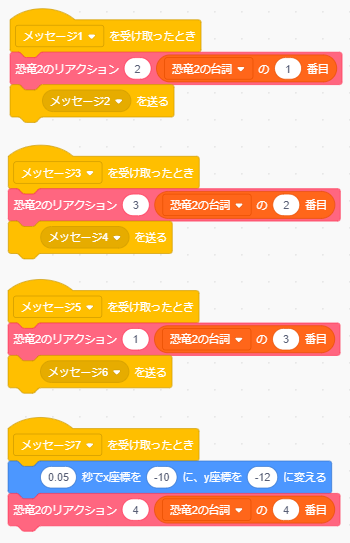

- これで恐竜2のプログラムは完成です。

  The Dinosaur 2 program is now complete.