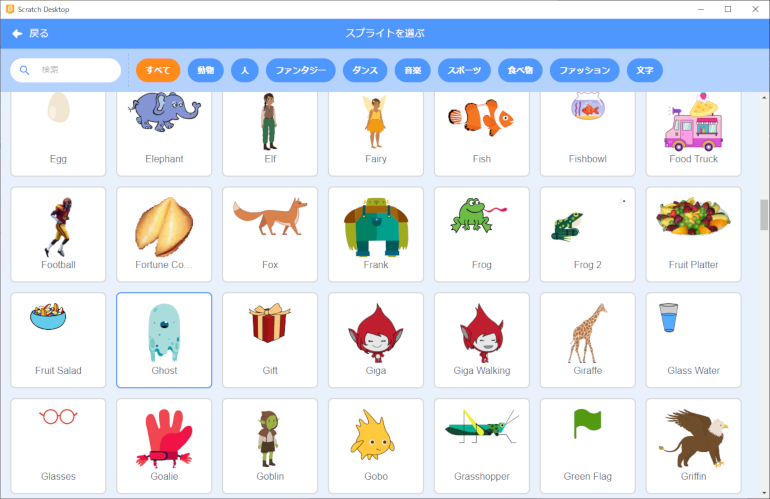
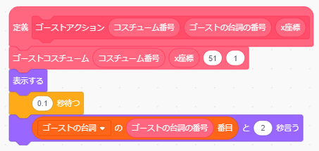

# 幽霊のプログラムの作り方

## 1.プログラムを作る前の準備(Preparation before develop the program)

-  ボタンをクリックしてください。

  Click on the  button.

- Ghostを選択、クリックしてください。

  Select Ghost and click on it.

- スプライトが設定されていることを確認してください。

  Make sure the sprites are set.

## 2. プログラムの作り方(How to develop a program)

### 2-1. 完成イメージ(Completed image)

### 2-2. 作り方(How to develop)

-  を押してください。

  Press  .

-  を押してください。

  Press  .

- ・以下の画面が表示されるので、 **『ブロック名』を『ゴーストコスチューム』 に変更** してください。

  Changed "Block Name" to "Ghost Costume".

- 『引数を追加(数値またはテキスト)』をクリックし、 **『number or text』を『コスチューム番号』に変更** してください。

  Click on "Add argument (number or text)" and change "number or text" to "costume number"

- 『引数を追加(数値またはテキスト)』をクリックし、 **『number or text』を『x座標』に変更** してください。

  Click on "Add argument (number or text)" and change "number or text" to "x-coordinate".

- 『引数を追加(数値またはテキスト)』をクリックし、 **『number or text』を『y座標』に変更** してください。

  Click on "Add argument (number or text)", change "number or text" to "y-coordinate".

- 『引数を追加(数値またはテキスト)』をクリックし、 **『number or text』を『タイマー』に変更** し、OKボタンを押してください。

  Click on "Add argument (number or text)", change "number or text" to "timer" and press the OK button.

- 以下の画面が表示されることを確認してください。

  Confirm that the following screen is displayed.

- 以下のブロックを画面中央にドラッグ&ドロップします。

  Drag and drop the following blocks to the center of the screen.

 

 

-  ○秒に  を、x座標の○に  を、y座標の○に  をドラッグ&ドロップしてください。

  Drag and drop  into the "X seconds" of  ,   into the "x-coordinates X", and  into the "y-coordinates X".

-  の「ghost-d」に  をドラッグ&ドロップしてください。

  Drag and drop  into the "ghost-d" of  .

- ブロックをくっつけてください。

  Connect the blocks.

-  を押してください。

  Press  .

-  を押してください。

  Press  .

- **『新しいリスト名：』に『ゴーストの台詞』と入力後、『このスプライトのみ』を選択** してOKボタンを押してください。

  Enter "Ghost's dialogue" in the "New List Name:" field, select "This sprite only" and click the OK button.

- 空のリストが画面上に表示されることを確認してください。

  Confirm that the blank list display on the screen.

- リストの＋ボタンを押し、 **『こっちだよ』、『こっちだってば』** 計2項目を設定してください。(1つ入力したら＋ボタンで項目を追加してください。)

  Press the + button on the list to set two items in total: "This way" and "This way". (When you enter one item, please add an item with the + button.)

-  を押してください。

  Press  .

-  を押してください。

  Press  .

- 以下の画面が表示されるので、 **『ブロック名』を『ゴーストアクション』に変更** してください。

  Change the "Block Name" to "Ghost Action".

- 『引数を追加(数値またはテキスト)』をクリックし、 **『number or text』を『コスチューム番号』に変更** してください。

  Click on "Add argument (number or text)" and change "number or text" to "costume number".

- 『引数を追加(数値またはテキスト)』をクリックし、 **『number or text』を『ゴーストの台詞の番号』に変更** してください。

  Click on "Add argument (number or text)" and change "number or text" to "Ghost's dialogue numbers".

- 『引数を追加(数値またはテキスト)』をクリックし、 **『number or text』を『x座標』に変更** し、OKボタンを押してください。

  Click on "Add argument (number or text)" and change "number or text" to "x coordinate" and press the OK button.

- 以下の画面が表示されることを確認してください。

  Confirm that the following screen is displayed.

- 以下のブロックを画面中央にドラッグ&ドロップします。

  Drag and drop the following blocks to the center of the screen.

  

 

 

 

- 『1秒待つ』の「1」を **『0.1』に変更** してください。(数字をダブルクリックすることで、数字を編集できる状態になります。)

  Change "1" in "Wait 1 second" to "0.1" . (Double-click on the number to make it ready for editing.)

-  の○に  をドラッグ&ドロップしてください。

  Drag and drop  to the X of  .

-  の「こんにちは!」に、  をドラッグ&ドロップしてください。

  Drag and drop   to the X of  .

-  の一番左の○に  を、左から2番目の○に  をドラッグ&ドロップしてください。また、 **右から2番目の○に『51』、一番右の○には『1』** と入れてください。

  Drag and drop  to the leftmost X of  , and  to the second X from the left.

  Put "51" in the second X from the right and "1" in the rightmost X.

- ブロックをくっつけてください。

  Connect the blocks.

- 以下のブロックを画面中央にドラッグ&ドロップします。

  Drag and drop the following blocks to the center of the screen.

    

  

 

 

-  の **「こんにちは!」を『やあ』に変更** してください。(文字をダブルクリックすることで、編集できる状態になります。)

  "Hello!" in  to "Hi". (Double-click on a character to make it ready for editing.)

-  の○に、 **左から『2』『134』『51』『1』と入れて** ください。

  Put "2", "134", "51", and "1" in X of  from the left.

- ブロックをくっつけてください。

  Connect the blocks.

- 以下のブロックを画面中央にドラッグ&ドロップします。
  
  Drag and drop the following blocks to the center of the screen.

 

  

 

- 『メッセージ1を受け取ったとき』の▼ボタンを押して、表示される **一覧から『メッセージ2』を選んで** ください。

  Press the ▼ button on "When you received message 1" and select "Message 2" from the list that appears.

- 『メッセージ1を送る』の▼ボタンを押して、表示される **一覧から『メッセージ3』を選んで** ください。

  Press the ▼ button for "Send Message 1" and select "Message 3" from the list that appears.

-  の○に、 **左から『1』『1』『-134』と入れて** ください。

  Put "1", "1", and "-134" in the X of  from the left.

- ブロックをくっつけてください。

  Connect the blocks.

- 以下のブロックを画面中央にドラッグ&ドロップします。

  Drag and drop the following blocks to the center of the screen.

  

 

- 『メッセージ1を受け取ったとき』の▼ボタンを押して、表示される **一覧から『メッセージ4』を選んで** ください。

  Press the ▼ button on "When you received message 1" and select "Message 4" from the list that appears.

- 『メッセージ1を送る』の▼ボタンを押して、表示される **一覧から『メッセージ5』を選んで** ください。

  Press the ▼ button for "Send Message 1" and select "Message 5" from the list that appears.

-   の○に、 **左から『2』『2』『134』と入れて** ください。

  Put "2", "2", and "134" in the X of  from the left.

- ブロックをくっつけてください。

  Connect the blocks.

- 以下のブロックを画面中央にドラッグ&ドロップします。

  Drag and drop the following blocks to the center of the screen.

  

  

 

  ×2

-  の **「こんにちは!」を『ばぁっ』に、「2秒」を『1秒』に変更** してください。(文字や数字をダブルクリックすることで、編集できる状態になります。)

  "Hello!" in  to "blah" and "2 seconds" to "1 second". (Double-click on a character to make it ready for editing.)

- 『メッセージ1を受け取ったとき』の▼ボタンを押して、表示される **一覧から『メッセージ6』を選んでく** ださい。

  Press the ▼ button on "When you received message 1" and select "Message 6" from the list that appears.

- 『メッセージ1を送る』の▼ボタンを押して、表示される **一覧から『メッセージ7』を選んで** ください。

  Press the ▼ button for "Send Message 1" and select "Message 7" from the list that appears.

-  の○に、 **左から『3』『110』『40』『0.01』と入れて** ください。

  Put "3", "110", "40" and "0.01" in the X of  from the left.

- もう一つの の○に、 **左から『4』『-256』『45』『0.05』と入れて** ください。

  Put "4", "-256", "45" and "0.05" in the X of  from the left.

- ブロックをくっつけてください。

  Connect the blocks.

- これで幽霊のプログラムは完成です。

  The ghost program is now complete.
